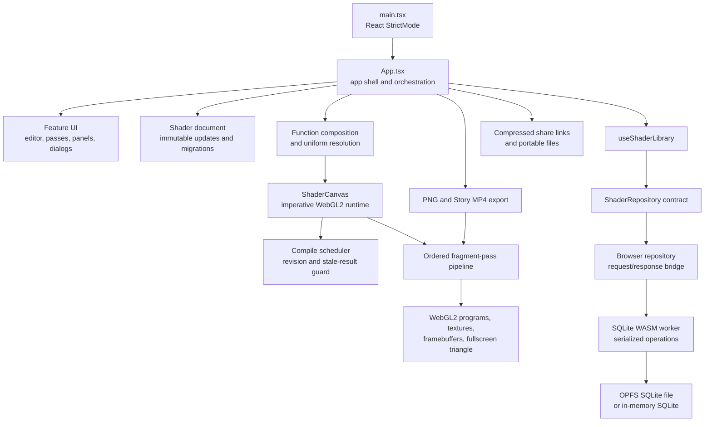
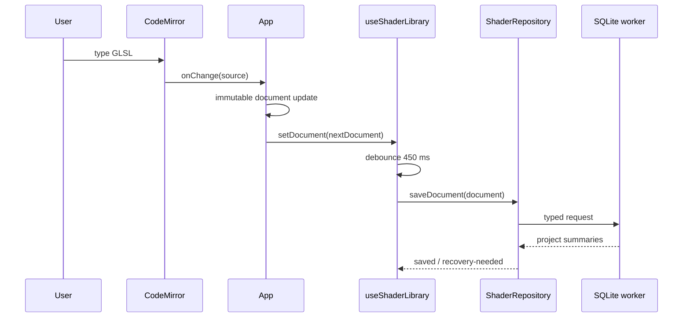

# receh architecture

Status: current implementation reference  
Repository: `FragCoordRe`  
Product name: **receh**

This document describes the architecture that exists in the repository today. It is intentionally
separate from the proposed improvements in [`docs/RefactorPlan.md`](docs/RefactorPlan.md).
Terminology follows the [product glossary](docs/glossary.md).

## Summary

receh is a browser-first React 19/Vite application for editing, compiling, previewing, tuning,
saving, sharing, and exporting GLSL fragment shaders. It has no server or account layer. The active
Shader document lives in React state, while durable projects and recovery snapshots are stored
through an asynchronous repository contract.

The implementation has four important boundaries:

1. `App` coordinates the app shell, document actions, editor state, renderer state, playback, and
   panels.
2. The document and shader helpers transform immutable data without knowing about React.
3. `ShaderCanvas` owns the imperative WebGL2 runtime and uses the pure-ish pass-pipeline helpers
   for compilation results, framebuffer targets, uniforms, and drawing.
4. `ShaderRepository` hides persistence. The current browser adapter sends typed requests to a
   serialized SQLite WASM worker backed by OPFS when available, with an in-memory fallback.

The repository boundary and versioned document model are already suitable seams for a future
native client. The UI, CodeMirror editor, HTML canvas, WebGL DOM events, PWA APIs, browser worker,
and media APIs are still browser-specific.

## System view



The runtime has two loops that intentionally remain separate:

- The React loop renders controls and derives the current render input from the Shader document.
- The WebGL loop runs inside `ShaderCanvas` through `requestAnimationFrame`, retaining programs,
  framebuffer targets, pointer state, playback time, and GPU objects in refs rather than React
  state.

## Entry point and composition

[`src/main.tsx`](src/main.tsx) is the only application entry point. It:

- imports the bundled fonts and global stylesheet;
- creates a React root from `#root`;
- renders `<App />` inside `StrictMode`.

There is no router, global state provider, or dependency-injection container. `App` is the current
composition root and receives its persistence behavior from `useShaderLibrary()`.

## Layers and responsibilities

### App shell and session orchestration

[`src/App.tsx`](src/App.tsx) owns the current user session. It connects the document hook, source
composition, editor, preview, playback toolbar, mobile navigation, dialogs, library, settings,
uniform tuner, exports, share-link imports, and PWA status.

It owns three kinds of state:

| State kind                 | Examples                                                                                                            | Current owner                        |
| -------------------------- | ------------------------------------------------------------------------------------------------------------------- | ------------------------------------ |
| Canonical project data     | Shader document, Global functions                                                                                   | `useShaderLibrary` and `App` setters |
| Derived render/editor data | Active pass, composed shader source, line origins, runtime uniforms, diagnostics filtered by Source scope           | `App` calculations and `useMemo`     |
| Session/UI state           | Mobile pane, code presentation, open panels, playback controls, selected diagnostic, fullscreen, editor preferences | `App` or focused feature hook        |

The current design is intentionally centralized, but `App` is also the largest coupling point in
the repository: it contains most event handlers and renders the whole app shell. That is the main
React refactor target.

### Feature UI

Feature components are mostly controlled components. They receive data and callbacks from `App`
and do not directly mutate the Shader document.

| Area          | Main files                                                         | Responsibility                                                                              |
| ------------- | ------------------------------------------------------------------ | ------------------------------------------------------------------------------------------- |
| Code pane     | `src/editor/ShaderEditor.tsx`, `glslLanguage.ts`, `glslCatalog.ts` | CodeMirror 6 state, GLSL completion, search, references, diagnostics, and editor appearance |
| Pass strip    | `src/passes/PassToolbar.tsx`                                       | Active-pass selection and pass management controls                                          |
| Local library | `src/library/LibraryPanel.tsx`                                     | Projects, snapshots, import/export, save status, storage messages                           |
| Uniform Tuner | `src/uniforms/UniformTunerPanel.tsx`                               | Runtime custom-uniform controls and explicit Bake into GLSL                                 |
| Settings      | `src/settings/EditorSettingsPanel.tsx`                             | Device-local editor preferences                                                             |
| GLSL Docs     | `src/editor/GlslDocsPanel.tsx`, `glslCatalog.ts`                   | Bundled offline GLSL reference                                                              |
| Export        | `src/export/ExportPanel.tsx`                                       | PNG and Story MP4 capability, progress, cancellation, and downloads                         |
| PWA           | `src/pwa/*`                                                        | Install prompt, update lifecycle, storage health, and service-worker state                  |

The feature components are browser UI components. The data and transformation helpers they call
are the more portable part of the implementation.

### Shader document model

[`src/document/shaderDocument.ts`](src/document/shaderDocument.ts) defines the portable data model:

```text
ShaderDocument
├─ schemaVersion: 4
├─ id, title
├─ functionsSource: Project functions
├─ activePassId
└─ passes[]
   ├─ id, name, kind="fragment", language="glsl"
   ├─ source
   ├─ uniformValues
   └─ resolutionScale: full | half | quarter
```

The update functions return new document objects rather than mutating prior state. They cover
source, title, active pass, pass order, pass resolution, pass deletion, project functions, and
tuned values. The parser accepts legacy document versions and migrates them to the current schema.
Imported documents are validated more strictly and receive new IDs when inserted into the local
library.

The Shader document is portable. It does not contain React state, WebGL handles, DOM nodes,
editor selections, playback time, diagnostics, or browser storage metadata.

### Source composition and uniforms

[`src/functions/functionLibrary.ts`](src/functions/functionLibrary.ts) models the three Source
scopes used by the editor:

- Global functions: local-library source shared across projects.
- Project functions: source stored inside one portable Shader document.
- Fragment pass source: the authored GLSL for one ordered pass.

`composeShaderSource()` produces renderer input by inserting Global functions and then Project
functions before the first user-defined function in the pass. It also returns line origins so
compiler diagnostics can be mapped back to the authored Source scope.

[`src/uniforms/uniformParser.ts`](src/uniforms/uniformParser.ts) parses supported custom uniform
declarations and annotations. Reserved runtime uniforms such as `u_resolution` and `u_time` are
not exposed in the Uniform Tuner. Stored values are resolved to typed runtime uniforms; they only
become GLSL constants when the user explicitly chooses Bake into GLSL.

### Preview and renderer

[`src/renderer/ShaderCanvas.tsx`](src/renderer/ShaderCanvas.tsx) is the React/WebGL boundary. On
mount it creates a WebGL2 context and fullscreen-triangle buffer, installs context-loss handlers,
and starts a `requestAnimationFrame` loop. Mutable runtime data is kept in refs:

- WebGL programs by pass ID;
- framebuffer targets by intermediate pass ID;
- compile revisions and schedulers;
- playback time and frame number;
- pointer, drag, and scroll uniforms;
- per-pass compile errors and the context-lost flag.

The lower-level files are independent of JSX:

- `webgl.ts` compiles programs, allocates framebuffer targets, binds uniforms and textures, and
  draws one fullscreen triangle.
- `passPipeline.ts` allocates/reuses intermediate targets and executes ordered passes.
- `compileScheduler.ts` identifies a compile result by document, pass, source revision, request,
  and generation so delayed results cannot replace newer work.
- `diagnostics.ts` parses browser-specific WebGL/ANGLE logs into line-based diagnostics.

The renderer retains the last-good program for the same document/pass while a newer source fails.
Switching to another document disposes the old programs and targets, preventing one project's
frame from being shown as another project's recovery frame.

### Persistence

[`src/document/repository.ts`](src/document/repository.ts) is the persistence boundary. It
contains no React or browser implementation details and exposes operations for:

- initialize/load/list/save projects;
- save Global functions;
- create, list, pin, and restore snapshots;
- import/export portable documents;
- import/export the whole SQLite library.

[`useShaderLibrary.ts`](src/document/useShaderLibrary.ts) adapts that contract to React. It handles
initialization, legacy `localStorage` migration, active-project selection, debounced document and
Global-functions saves, idle snapshots, guarded risky actions, and save/recovery status.

[`browserRepository.ts`](src/document/browserRepository.ts) sends typed request messages to one
SQLite worker. The worker:

1. initializes SQLite WASM;
2. opens an OPFS database when the OPFS VFS is available, otherwise an in-memory database;
3. validates and migrates the SQLite schema;
4. executes project, snapshot, import, and export operations;
5. serializes requests through an operation queue and posts typed responses back to the main
   thread.

The current SQLite schema stores projects and ordered passes in relational tables, tuned values as
JSON per pass, snapshots as validated document JSON with content hashes, and Global functions in a
single-row table. The browser adapter is reusable in concept, but the worker and OPFS details are
not native-compatible.

### Export and sharing

`src/export/renderExport.ts` creates a separate offscreen WebGL2 context, compiles the same
`ShaderPipelinePass` data, and calls the same ordered pass renderer used by the live preview. PNG
export therefore shares the live pass semantics. `storyVideo.ts` renders deterministic frames with
Mediabunny when available and falls back to a browser `MediaRecorder` path.

`src/share/shareLink.ts` creates a versioned compressed URL payload for small projects. The App
imports a shared payload as a new local project, bundling any source dependencies into the imported
Project functions rather than mutating the recipient's Global functions.

### PWA and browser platform services

The PWA layer uses a generated service worker, web manifest, `localStorage`, `navigator.storage`,
`visualViewport`, the Fullscreen API, `window.confirm`/`window.alert`, browser file inputs and
downloads, URL history, and browser sharing/clipboard APIs. These are all outside the portable
document and shader-engine boundaries.

## State and data flow

### Editing and saving



The editor itself keeps CodeMirror's history and selection in its imperative `EditorView`. The
portable Shader document is the saved source of truth; editor history is not persisted as a named
Snapshot.

### Compile and render

```mermaid
flowchart LR
  D[Shader document + Global functions] --> C[composeShaderSource]
  C --> R[ShaderPipelinePass[]\nsource, line origins, uniforms, scale]
  R --> F[compile fingerprint]
  F --> T[450 ms compile request]
  T --> S[per-pass revision scheduler]
  S --> P[WebGL vertex + fragment program]
  P --> E[compiled pass map]
  E --> M[renderPassPipelineFrame]
  M --> G[intermediate framebuffers]
  G --> O[final output canvas]
```

Changing only a stored custom uniform changes the render input but does not change the composed
source fingerprint, so it can be applied without recompiling. Changing source, project functions,
Global functions, pass order, or pass count changes the compile target.

## Dependency direction today

The intended direction is from UI to domain helpers and from platform adapters to contracts, but
the current composition root is broad:

```text
App
├─ document model + repository hook
├─ editor + function catalog
├─ renderer + diagnostics
├─ playback + browser viewport APIs
├─ export + share + PWA
└─ every panel
```

Some lower-level dependencies still cross ideal layer boundaries. For example, the function
library imports the diagnostic type from the renderer folder, and export code imports the renderer
pipeline directly. These are workable today, but should become shared shader-engine contracts if a
native renderer is added.

## Testing strategy

The repository has focused unit tests for the highest-risk pure behavior:

- document migration and immutable pass operations;
- repository-adjacent storage and import validation;
- source composition and diagnostic mapping;
- uniform parsing, color conversion, and baking;
- compile revision invalidation;
- ordered pass texture binding and framebuffer lifecycle;
- share links, downloads, playback, PWA behavior, and editor preferences.

Browser-visible behavior still needs real-browser verification because WebGL, CodeMirror, keyboard
insets, media encoding, OPFS, service workers, and responsive layout cannot be fully represented by
the unit suite.

## Native migration boundary

The most reusable units for an Expo/native effort are:

- `ShaderDocument`, migrations, serialization, and immutable updates;
- Source composition, line-origin mapping, uniform parsing, diagnostics, and compile scheduling;
- the abstract shape of `ShaderPipelinePass` and the pass-order math;
- repository contracts and SQLite schema concepts;
- pure timeline, share-envelope, and document import/export logic.

The units that need adapters or replacement are:

- HTML/CodeMirror UI and CSS;
- `HTMLCanvasElement` and WebGL2 context ownership;
- Web Worker and `@sqlite.org/sqlite-wasm`/OPFS storage;
- browser downloads, URL history, Clipboard/Web Share, Fullscreen, service workers, and
  `MediaRecorder`/Mediabunny;
- browser visual-viewport keyboard detection and DOM pointer events.

For Android and iOS, an Expo shell can initially host the existing web editor through a DOM/WebView
surface while native storage, sharing, and file actions are introduced around it. A truly native
editor would need React Native text editing and a native GL surface. macOS is a separate target:
React Native macOS is an out-of-tree platform and Expo's additional-platform guidance requires
platform-specific validation. The detailed sequence is in [`docs/RefactorPlan.md`](docs/RefactorPlan.md).
