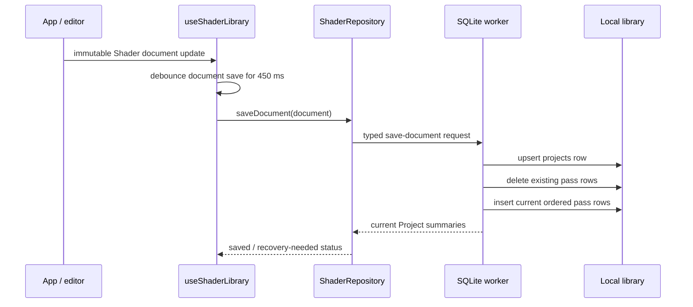

# Project storage and format compatibility

Status: current implementation reference and migration guidance  
Product: **receh**

This document answers how a Project is stored today, what the Local library can contain, how
Snapshots relate to versions, and what to preserve when changing the project format. It uses the
canonical terms in [`docs/glossary.md`](glossary.md).

## Short answer

- There is one browser Local library database per app storage origin. There is no persisted
  `Workspace` entity, workspace ID, team, or project-group table.
- The database has no application-level maximum project count. The practical limits are browser
  storage quota, the size of the SQLite backup/import, device memory, and UI/rendering cost.
- A Project is stored as one row in `projects` and one ordered row per Fragment pass in `passes`.
  Saving replaces the current Project row and rewrites that Project's pass rows.
- The current row is the latest saved state only. It is not a version table.
- Durable recovery versions are Snapshots. A Snapshot stores a complete serialized Shader document,
  content hash, reason, optional name, and pin state.
- Automatic and manual Snapshot retention keeps the latest 50 unpinned Snapshots per Project.
  Pinned Snapshots are excluded from that rolling limit and can grow until storage is exhausted.
- Editor undo/redo history is CodeMirror history and is not stored in SQLite. There is no durable
  revision lineage or undo tree yet.

## Storage scope: what “workspace” means today

The glossary's **Workspace** means the visible app area containing the Preview pane and Code pane.
It does not mean a database workspace.

Persistently, the current browser implementation has this shape:

```text
browser storage origin
└─ one receh Local library
   ├─ many Projects
   ├─ Snapshots belonging to those Projects
   └─ one Global functions source
```

The SQLite filename constant is currently `/shader-pocket.sqlite3`, and the exported backup is
named `receh.sqlite3`. The `SHADER_POCKET_*` constant names are legacy implementation names left
over from an earlier product name; they are part of the current compatibility checks and should not
be casually changed.

The browser opens SQLite WASM in a dedicated worker. If the OPFS VFS is available, the worker uses
the persistent OPFS file. Otherwise, it opens an in-memory SQLite database and the UI reports that
edits are memory-only. The browser `localStorage` keys are only used for migration, small device
preferences, and the ID of the last active Project; they are not the primary Project store after
the SQLite library is initialized.

There is currently no way to create a second local library, switch between libraries inside the
app, or assign Projects to a named Workspace. A whole-library SQLite export/import is the closest
equivalent to moving a storage scope between devices.

## Database schema

The current SQLite `user_version` is 5 and the application ID is `0x53504b54`. Foreign keys are
enabled. The schema is defined in
[`src/document/databaseSchema.ts`](../src/document/databaseSchema.ts).

```text
projects
├─ id                 TEXT primary key
├─ title
├─ functions_source   Project functions
├─ active_pass_id
├─ schema_version     Shader document schema version
├─ created_at
└─ updated_at

passes
├─ id                 TEXT primary key
├─ project_id         -> projects.id, cascade delete
├─ position           ordered index within a Project
├─ name
├─ kind               currently "fragment"
├─ language           currently "glsl"
├─ source
├─ uniform_values_json
└─ resolution_scale

snapshots
├─ id                 TEXT primary key
├─ project_id         -> projects.id, cascade delete
├─ created_at
├─ reason
├─ name
├─ pinned
├─ content_hash       SHA-256 of canonical document content
└─ document_json      complete serialized Shader document

global_sources
├─ id                 currently the singleton "functions"
├─ source             Global functions
└─ updated_at
```

There are indexes for Project recency and Snapshot recency. `passes` has a unique
`(project_id, position)` constraint, so order is represented by the `position` column rather than
by a linked-list relation.

## How a Project is written

The write path is:



`writeDocumentTo()` preserves the existing `created_at` when the Project ID already exists and
updates `updated_at` on every save. It writes the current document's title, Project functions,
active pass, and document schema version to `projects`. It then deletes all rows in `passes` for
that Project and inserts the current ordered array.

This means the current save strategy is simple and consistent, but it is not an incremental diff
store. A Project with many passes rewrites all of its pass rows after a save even when only one
source string changed.

### Project count and size limits

There is no `MAX_PROJECTS` constant, database constraint, or retention job for Projects. In
principle, the `projects` table can contain as many Projects as the storage medium and SQLite can
handle.

The effective limits are:

| Limit                          | Current behavior                                                                              |
| ------------------------------ | --------------------------------------------------------------------------------------------- |
| Project count                  | No product-level count limit; bounded by browser/device storage and application performance   |
| Single portable Project import | 2 MiB in `src/document/imports.ts`                                                            |
| Whole-library SQLite import    | 128 MiB in `src/document/imports.ts`                                                          |
| Snapshot retention             | 50 unpinned Snapshots per Project; pinned Snapshots are not counted by trimming               |
| Fragment pass count            | No document/database count limit; practical rendering limit is WebGL texture units and memory |
| Source length                  | No explicit database limit; bounded by storage, compile time, memory, and import limits       |
| Project list loading           | All Project summaries are loaded into the app; there is no pagination today                   |

The 2 MiB limit applies to a portable Project file read through the browser import flow. A Project
already saved in the Local library can be larger, subject to the browser's storage quota and the
runtime's ability to compile and render it.

## How Project versions are stored

There are three different meanings of “version” in the current code. They must not be conflated.

| Term             | Current meaning                                                  | Durable?                                                  |
| ---------------- | ---------------------------------------------------------------- | --------------------------------------------------------- |
| `schemaVersion`  | Shape/version of the portable Shader document format             | Yes, stored in the document and `projects.schema_version` |
| Compile revision | Ownership token for rejecting stale asynchronous compile results | No, runtime-only                                          |
| Snapshot         | Complete recovery copy of one Project state                      | Yes, stored in `snapshots.document_json`                  |

### Current Project state

`projects` plus its `passes` rows represent only the latest saved state. Calling `saveDocument()`
does not create a version row. It updates the Project in place.

### Snapshots as recovery versions

[`src/document/repository.ts`](../src/document/repository.ts) defines Snapshot reasons:

```text
manual
idle
before-reset
before-import
before-restore
before-bake
before-pass-delete
migration
imported
```

`useShaderLibrary()` schedules an automatic `idle` Snapshot after 30 seconds without a document
change. It also creates recovery Snapshots before risky actions such as reset, import, restore,
uniform baking, and pass deletion. A manual Snapshot can have a name and be pinned.

Every Snapshot stores the complete JSON document, not a patch or SQL diff. The document is parsed
and migrated when Snapshot summaries or Snapshot contents are read.

### Snapshot deduplication and retention

`hashShaderDocument()` hashes a canonical serialization of the document, including:

- document schema version, ID, title, Project functions, and active pass;
- every pass ID, name, kind, language, source, tuned uniform values, and resolution scale.

The database has `UNIQUE(project_id, content_hash)`. Repeated automatic saves of identical content
therefore do not create duplicate Snapshot rows. When a manual Snapshot matches an existing hash,
the existing row can be promoted to `manual`, named, and pinned instead of storing another copy.

After insertion or pin changes, trimming deletes only unpinned rows beyond the newest 50 for that
Project. Pinned rows are deliberately retained. There is no separate cap on pinned rows, so a future
storage-pressure policy should account for them explicitly.

### What is not stored

The following are not Project versions in SQLite today:

- CodeMirror cursor, selection, fold state, or editor undo/redo history;
- compile revisions or compile requests;
- Last-good WebGL programs;
- playback time, pointer state, or renderer frame counters;
- panel layout, mobile navigation, and other session UI state;
- browser-specific Global functions inside a portable Project unless they were intentionally bundled
  into Project functions during share/import.

## Startup, migration, and active Project selection

On startup, the browser hook first reads the old localStorage document/source keys as a possible
legacy migration input. It also reads the last active Project ID from localStorage.

The SQLite worker then:

1. opens SQLite WASM;
2. selects OPFS persistence when available or an in-memory database otherwise;
3. validates the SQLite application ID and `user_version`;
4. applies the current schema shape and additive column repairs;
5. lists Projects by `updated_at DESC, title`;
6. creates a starter Project if the library is empty;
7. clones the legacy localStorage document into a new Project and creates a `migration` Snapshot when
   migrating an old draft;
8. restores the preferred active Project if its ID still exists, otherwise the first Project in the
   recency-ordered list.

Once initialization succeeds, the active Project ID is kept in localStorage for fast selection on
the next load. The document itself is loaded from SQLite.

If persistence cannot be initialized, the editor can still operate in memory, but the save status
becomes unavailable or recovery-needed. This is not a second durable workspace.

## Portable Project format

The portable format is the JSON serialization of the current `ShaderDocument`, downloaded with a
`.receh.json` extension. The current document schema is version 4:

```json
{
  "schemaVersion": 4,
  "id": "project-id",
  "title": "Untitled shader",
  "functionsSource": "",
  "activePassId": "pass-id",
  "passes": [
    {
      "id": "pass-id",
      "name": "main.frag",
      "kind": "fragment",
      "language": "glsl",
      "source": "#version 300 es ...",
      "uniformValues": {},
      "resolutionScale": 1
    }
  ]
}
```

A `.frag` import is different: it is treated as source-only input and wrapped into a new
single-pass portable Project. Legacy `.shaderpocket.json` files are still accepted in addition to
`.receh.json` files.

The portable Project includes Project functions and per-pass tuned values. Global functions are
not automatically part of a normal Project file because they belong to the Local library. Share
imports intentionally bundle required Global functions into the imported Project's Project
functions so the recipient's Global functions are not modified.

## Whole-library backup and import behavior

A Library backup is a binary SQLite export containing multiple Projects, their Snapshots, and the
Global functions source. It is not the same format as a portable `.receh.json` Project.

Whole-library import is a merge operation:

1. The incoming bytes are opened read-only in an in-memory SQLite database.
2. The incoming application ID and database version are checked.
3. Each incoming Project is loaded and migrated through the Shader document parser.
4. If its Project ID or any pass ID collides with the target library, new IDs are generated and the
   active pass relationship is remapped.
5. Incoming Snapshots are loaded for the remapped Project, with their document IDs remapped when
   necessary.
6. Global functions are retained, adopted if the target is empty, or appended under an
   `Imported global functions` comment if both libraries contain different source.
7. The first valid imported Project becomes the active Project returned to the UI.

Single Project import is also non-destructive: the imported document is cloned with new Project and
pass IDs, saved as a new Project, and does not replace the current Project.

## Current backward-compatibility behavior

### Portable document readers

`migrateShaderDocument()` currently accepts:

- version 0/source-only legacy values, including values with no `schemaVersion`;
- document versions 1, 2, 3, and 4;
- valid pass arrays with missing optional values repaired to defaults.

It normalizes accepted inputs to the current `ShaderDocument` type and schema version. The current
implementation does not preserve unknown JSON fields in the typed document; unrecognized data is
discarded during normalization.

`parseImportedShaderDocument()` is stricter than the local draft reader. Invalid JSON, unsupported
versions, missing source, empty pass arrays, and invalid passes produce import errors rather than
silently opening the starter Project.

### SQLite readers

`ensureDatabaseSchema()` accepts database versions 0 through 5, rejects a database with a different
application ID, and rejects a database newer than the current app understands. It creates missing
tables and adds columns such as Project functions, tuned uniform values, resolution scale, Snapshot
names, and pin state when they are absent. It then sets the current application ID and
`user_version`.

This is an additive, in-place migration strategy. An older database can be opened and upgraded by
the current app, but a newer database is intentionally not downgraded or guessed at by an older
app.

### Snapshot readers

Snapshot `document_json` uses the same portable document parser. This allows old Snapshot rows to
remain readable after the document schema advances, provided the app retains the corresponding
document migration path.

## Rules for changing the Project format

The safest policy is **read many, write one**:

```text
accept supported historical versions
  -> validate
  -> migrate in memory to one canonical current model
  -> write only the current version
```

Apply that policy independently to the following versioned boundaries:

1. Portable Shader document `schemaVersion`.
2. SQLite library `PRAGMA user_version` and application ID.
3. Share-link envelope version.
4. File extensions and import aliases.

Do not use one number for all four. A share link can evolve without changing the document model, and
the SQLite schema can evolve without changing the portable JSON shape.

### Prefer additive changes

When changing a document:

- add optional fields with safe defaults;
- keep existing field meanings stable;
- keep IDs stable when editing the same Project;
- preserve pass order and the active-pass relationship;
- preserve exact GLSL source unless the migration explicitly transforms it;
- preserve tuned values and their types;
- make new required capabilities fail with a clear unsupported-version error;
- do not silently interpret an old field as a different new field.

For a rename, read both the old and new field for at least the supported compatibility window,
prefer the new field, and write only the new field after migration. For a removed field, decide
whether it is safely ignorable; if not, reject the document rather than dropping user data.

### Use explicit one-step migrations

The current parser normalizes versions 1–4 in one broad path. Before the next incompatible change,
introduce explicit, pure migration functions:

```ts
type DocumentMigration = (input: unknown) => unknown;

const documentMigrations: Record<number, DocumentMigration> = {
  0: migrateV0ToV1,
  1: migrateV1ToV2,
  2: migrateV2ToV3,
  3: migrateV3ToV4,
  4: migrateV4ToV5,
};
```

Each step should be:

- deterministic and side-effect free;
- idempotent at its own version boundary;
- independently unit-tested with a fixture;
- able to validate required fields before producing the next version;
- usable for both a current Project and every stored Snapshot.

Keep migration provenance available for diagnostics, such as the original version and the final
version, even if it is not persisted in the public document.

### Evolve SQLite transactionally

For every database version:

1. check application ID and reject unknown applications;
2. start a transaction;
3. run exactly one migration step from the current `user_version` to the next;
4. backfill or validate data where needed;
5. update `user_version` only after the step succeeds;
6. commit;
7. repeat until the current version is reached.

Do not set `user_version` before a migration finishes. Do not remove old columns in the same release
that introduces their replacement if rollback or older app interop matters. Keep a backup/recovery
path before destructive database migrations.

The current schema repair code uses column inspection and then sets the latest version. That works
for the current local-first app, but a migration registry with transactional steps is safer as the
schema becomes more complex or is shared with Expo native adapters.

### Keep old files importable

When changing the format:

- continue accepting `.shaderpocket.json` as an alias while old files exist in the wild;
- keep `.frag` as source-only import unless its semantics are deliberately changed;
- write the latest `.receh.json` format;
- keep a small set of golden fixtures for every historically exported document version;
- test Unicode titles, multiple passes, Project functions, tuned values, resolution scales, active
  pass changes, and unknown/invalid fields;
- test that importing the same file does not overwrite the current Project.

If an old app must open a new file, the new file needs a genuinely compatible subset or a separate
export target. Do not expect an old app to understand a newer required pass kind or storage feature
just because the JSON remains syntactically valid.

### Keep identity separate from format

Project IDs and pass IDs identify entities; schema versions identify their representation. Never
derive a new format by reusing an existing ID or by treating a changed title/source hash as a new
Project automatically.

For import and library merge:

- preserve IDs when there is no collision and lineage preservation is intended;
- generate new Project and pass IDs for single-project imports by default;
- remap `activePassId`, Snapshot documents, and every relationship together;
- report collisions and remapping to the user;
- do not use title equality as identity.

## Recommended future format envelope

The current bare JSON document is adequate for local V1. If the format needs capabilities,
dependencies, or external assets, add a small explicit envelope rather than overloading
`ShaderDocument` fields:

```json
{
  "format": "receh-project",
  "formatVersion": 1,
  "document": {
    "schemaVersion": 5,
    "id": "project-id",
    "title": "...",
    "functionsSource": "...",
    "activePassId": "pass-id",
    "passes": []
  },
  "dependencies": [],
  "assets": []
}
```

Recommended rules for such an envelope:

- keep `format` stable and explicit;
- use `formatVersion` for envelope changes and `document.schemaVersion` for document changes;
- make `dependencies` and `assets` optional until they are implemented;
- include capability declarations when an older app cannot faithfully render the Project;
- validate before importing and preserve the current Project on failure;
- keep the existing bare-document reader for a defined deprecation period.

Do not introduce the envelope solely to rename fields. Add it when the format has metadata that
cannot safely live inside the Shader document itself.

## Compatibility test matrix

Every Project format or SQLite schema change should add fixtures and tests for:

| Case                           | Expected result                                                                       |
| ------------------------------ | ------------------------------------------------------------------------------------- |
| Current document               | Loads unchanged and writes current version                                            |
| Every supported older document | Migrates to current model without source/pass loss                                    |
| Legacy source-only document    | Becomes a valid new single-pass Project                                               |
| Old Snapshot JSON              | Lists and restores through the same migration path                                    |
| Older SQLite database          | Opens, migrates transactionally, and retains Projects/Snapshots                       |
| Newer SQLite database          | Fails clearly without modifying it                                                    |
| Wrong application ID           | Fails clearly without opening as receh                                                |
| Unknown optional field         | Is preserved or intentionally discarded according to the documented policy            |
| Unknown required capability    | Fails with an actionable unsupported-version message                                  |
| Project ID collision           | Imports as a new identity and remaps all pass/Snapshot relationships                  |
| Corrupt row or Snapshot        | Does not prevent unrelated valid Projects from being recovered where possible         |
| Round-trip export/import       | Preserves title, functions, pass order, source, uniforms, resolution, and active pass |

At minimum, run the document migration tests, storage tests, import tests, Snapshot tests, and a
real browser backup/restore flow before changing the current schema version.

## If a future Workspace is added

If the product later needs named workspaces, teams, or separate project collections, add that as a
new domain concept instead of overloading the current Workspace UI term. A likely relational shape
would be:

```text
workspaces
├─ id
├─ name
└─ created_at / updated_at

projects
└─ workspace_id -> workspaces.id
```

Before adding it, define:

- whether a Project can belong to one Workspace or many;
- whether Global functions are library-wide or Workspace-scoped;
- how existing Projects are assigned during migration;
- whether a Library backup contains all Workspaces or one selected Workspace;
- how IDs, Snapshots, share links, and future cloud sync handle Workspace boundaries.

For the current app, adding a `workspace_id` with a default value would be a migration detail, not
proof that the current database already supports workspaces.

## Related documents and source

- [Architecture](../Architecture.md)
- [Internal fragment-shader processing](../internal.md)
- [Refactor plan](RefactorPlan.md)
- [Repository contract](../src/document/repository.ts)
- [SQLite schema](../src/document/databaseSchema.ts)
- [SQLite worker](../src/document/sqlite.worker.ts)
- [Shader document model](../src/document/shaderDocument.ts)
