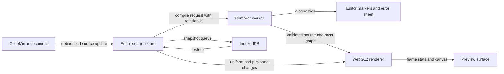

# Mobile-first FragCoord-style editor plan

Status: proposed  
Research basis: [fragcoord-editor-research.md](./fragcoord-editor-research.md)

## Decision

Build the editor as a mobile-first React web app/PWA, with the shader engine and document model in framework-neutral TypeScript packages. Use CodeMirror 6 for source editing and WebGL2 for the first rendering backend. Add a React Native/Expo shell only after the web editor works well on real phones.

This preserves the technology that makes FragCoord effective—browser shader compilation, canvas rendering, Web Workers, share links, media APIs, and fast iteration—while removing its largest phone liability, Monaco. It also leaves two viable native paths:

1. Wrap the complete web editor in `react-native-webview` for store distribution and native integrations.
2. Reuse the document/compiler packages in a later native renderer built on Expo GLView or React Native WebGPU.

Do not begin with a fully native editor. It would force simultaneous rewrites of the text editor, shader runtime, capture pipeline, browser permission flows, and sharing behavior before the mobile UX is validated.

## Architecture options

| Option                          | Code reuse                           | Phone editing                                   | GPU parity                                      | Delivery risk         | Recommendation                  |
| ------------------------------- | ------------------------------------ | ----------------------------------------------- | ----------------------------------------------- | --------------------- | ------------------------------- |
| Responsive React PWA            | Highest                              | Strong with CodeMirror 6                        | Best WebGL2 parity; progressive WebGPU          | Low                   | Build first                     |
| Expo shell + WebView            | Reuses the whole web app             | Strong if keyboard/insets are handled carefully | Same as the embedded web engine                 | Medium                | Add after PWA validation        |
| Expo + GLView + native UI       | Reuses some TypeScript transforms    | Requires a separate editor integration          | Good WebGL-style path, more platform edge cases | High                  | Experimental follow-on          |
| React Native WebGPU + native UI | Reuses a future WGSL-oriented engine | Requires a separate editor integration          | Strong modern GPU path, not direct WebGL parity | High                  | Future advanced backend         |
| React Native Skia               | Native controls and rendering        | Requires a separate editor integration          | SkSL is not drop-in GLSL/WebGL                  | High for this product | Do not use as the main renderer |

## Recommended stack

### Web core

- React + TypeScript + Vite
- CodeMirror 6 with a small GLSL/WGSL language package, diagnostics, completion, search, and formatting hooks
- Zustand or a small reducer/store for editor-session state
- TanStack Query only when remote persistence is introduced
- WebGL2 renderer first; WebGPU behind capability detection later
- Comlink or a small typed message protocol for compiler/parser Web Workers
- IndexedDB for documents, snapshots, and cached textures; localStorage only for small preferences
- PWA manifest and Workbox after the first stable offline document flow
- Vitest for model/compiler units and Playwright for browser flows when the environment allows it

### Optional native shell

- Expo/React Native using the New Architecture
- `react-native-webview` for the complete editor surface
- `react-native-safe-area-context`, keyboard-controller/inset handling, deep links, share sheet, file import/export, and haptics in the shell
- A narrow, versioned bridge for open/save/share/theme/safe-area events; shader editing and rendering remain inside the web surface

### Later native renderer experiment

- Use Expo GLView when strict WebGL-style compatibility matters most.
- Use React Native WebGPU when WGSL/compute becomes a product requirement.
- Keep this experiment behind the same `RendererBackend` interface; do not fork the document model.

## Proposed package structure

```text
apps/
  web/                    React PWA and responsive editor shell
  mobile/                 Optional Expo shell, added after web validation
packages/
  document-model/         ShaderDocument, passes, migration, serialization
  shader-language/        Built-ins, parsing, diagnostics, completions
  shader-compiler/        GLSL transforms and worker protocol
  shader-renderer-web/     WebGL2 backend, textures, frame loop, capture
  editor-session/         Actions, history, autosave, compile scheduling
  ui-tokens/              Colors, spacing, type, target sizes, breakpoints
  bridge-protocol/        Optional WebView/native message schema
```

Keep React components out of the document, compiler, and renderer contracts. That is what makes the later Expo shell or native backend possible.

## Core runtime flow



Important invariants:

- Every edit has a monotonically increasing document revision.
- Compile results are ignored when their revision is stale.
- The last successful program keeps rendering while a new compile fails.
- Uniform changes do not rebuild the editor document unless the user explicitly commits them to source.
- Resizing the UI changes the presentation viewport without silently changing an explicitly configured shader resolution.
- Renderer failures are isolated per pass and cannot leave the app in an unrecoverable blank state.

## Mobile interaction model

### Phone portrait

Use one primary workspace at a time, not two permanently stacked panels.

- Default to a full-height preview after opening or running a shader.
- Use a persistent bottom navigation with `Preview`, `Code`, `Tune`, `Passes`, and `More`.
- `Code` opens the editor as the primary screen. Preview can appear as a collapsible 96–140 px live strip above the keyboard, and can be hidden with one tap.
- `Tune` opens a keyboard-safe bottom sheet with parsed uniforms and large controls.
- `Passes` opens a reorderable sheet/list; the active pass remains visible in the code header.
- Compile status appears as a compact chip above the bottom navigation. Tapping it opens diagnostics without covering the active line.
- Save/share/export live under `More`, while Save remains available as a single top action when signed in.

### Phone landscape

- Use side-by-side code and preview only when each pane can retain at least 320 px usable width.
- Otherwise keep the tabbed phone model.
- Hide secondary chrome during editing and let the user pin either the code or preview pane.

### Tablet and desktop

- Restore resizable split panes.
- Keep drag handles at least 24 px as interaction targets, even if the visible divider is 1–4 px.
- Allow code-left/code-right and horizontal/vertical layouts.
- Inspector can be a third pane or a drawer depending on available width.

### Keyboard and selection

- Use `visualViewport` only to measure keyboard occlusion, not to decide the entire information architecture.
- Keep the active line and diagnostic chip visible above the keyboard.
- Add an optional coding accessory row for Tab, brackets, braces, parentheses, semicolon, comment, undo, redo, and run.
- Preserve native long-press selection, copy/paste, dictation, autocorrection policy, and IME composition.
- Avoid intercepting two-finger browser/page zoom outside the preview canvas.

### Canvas gestures

- One finger: shader pointer/drag interaction.
- Two fingers: preview zoom/pan when the shader uses camera controls.
- Long press: show a small gesture/help menu rather than triggering hidden desktop hover behavior.
- A visible `Reset view` action must always recover the canvas.
- Suspend canvas gestures whenever a sheet, menu, or code selection is active.

## Responsive rules

Use capability and space thresholds instead of one 768 px breakpoint:

| Mode            | Suggested condition                                              | Layout                                   |
| --------------- | ---------------------------------------------------------------- | ---------------------------------------- |
| Phone compact   | usable width below 600 px or coarse pointer with narrow viewport | One workspace, bottom navigation, sheets |
| Phone landscape | height below 500 px and width below 900 px                       | Tabs by default; conditional two-pane    |
| Tablet          | 600–1023 px with at least 320 px per pane                        | Two-pane or one-pane plus drawer         |
| Desktop         | 1024 px and above with fine pointer                              | Full split workspace and resizers        |

Conditions should use container width, usable height after keyboard/safe areas, pointer type, and a user override. Do not infer layout from portrait-versus-landscape alone.

## Design system targets

Retain FragCoord's recognizable character without copying its exact implementation:

- JetBrains Mono throughout the technical workspace
- Near-black layered surfaces, orange primary accent, subdued violet ambient decoration, and compact bordered controls
- Dark, light, and blackout themes
- Compact desktop density and a separate comfortable touch density
- 4/6/8/12/16/24 px spacing scale
- Minimum 44 px primary phone controls and at least 24 px for every target
- Visible focus rings, high-contrast error/warning/success states, and no reliance on color alone
- Page zoom enabled; do not use `user-scalable=no`
- Motion reduced or removed under `prefers-reduced-motion`

## First-version feature slices

### Slice 0: technical spikes

Deliverables:

- CodeMirror 6 editing GLSL on iOS Safari and Android Chrome
- A WebGL2 canvas compiling and rendering a fragment shader
- Keyboard-open layout probe using `visualViewport`
- 30-minute thermal/memory test on one iPhone and one Android device
- Decision record confirming PWA-first or identifying a blocking browser limitation

Exit criteria:

- Native selection, paste, undo, and IME work on both platforms.
- Preview remains responsive while typing.
- A bad shader cannot crash the whole task or erase the last good frame.

### Slice 1: single-pass mobile editor

Deliverables:

- Document model and migrations
- Code/Preview phone navigation and desktop split layout
- GLSL syntax, completions for built-ins, diagnostics, and source-linked errors
- `u_resolution`, `u_time`, `u_time_delta`, `u_frame`, `u_mouse`, `u_drag`, and `u_scroll`
- Explicit Run/Compile and guarded auto-compile
- Local autosave and restore
- Image export and shareable compressed document URL for small shaders

Exit criteria:

- Complete create/edit/run/restore/share flow on the target device matrix.
- No required action hidden in a horizontal toolbar.
- All phone actions work with one hand and meet target-size rules.

### Slice 2: passes and tuner

Deliverables:

- Common source and ordered fragment passes
- Previous-pass textures and configurable pass resolution
- Add/rename/delete/reorder pass flow
- Parsed float/int/bool/vector/color uniforms
- Tuner bottom sheet and source commit/reset behavior
- Local named snapshots and diff-friendly history

Exit criteria:

- Three-pass shader runs without frame leaks after edits or reordering.
- Tuning does not move the text cursor or trigger unnecessary recompiles.
- Pass navigation remains usable with the keyboard open.

### Slice 3: accounts and publishing

Deliverables:

- Supabase auth, profiles, shaders, passes, revisions, and thumbnails
- Personal/unlisted/public visibility
- Stable `/s/{slug}` and `/embed/{slug}` routes
- Server validation, row-level security, quotas, and conflict handling
- Optimistic save with explicit offline/unsynced state

Exit criteria:

- Anonymous local work survives sign-in.
- Two-device edits cannot silently overwrite one another.
- Private source never appears in public queries or embed payloads.

### Slice 4: advanced media and GPU features

Add only after real usage validates the core:

- WebGPU/WGSL and compute passes
- Texture uploads, webcam, audio, keyboard texture, and screen capture
- WebM/MP4 recording
- Import/export conversion and ShaderToy compatibility
- Inspector, profiler, heatmap, and advanced compiler WASM
- Tutorials, collaboration, community, and marketplace modules

## Compile and rendering strategy

### WebGL2 baseline

- Own the canvas and GL context directly; avoid a large scene-graph library.
- Compile a fixed full-screen triangle vertex shader plus the user's fragment shader.
- Inject built-ins through a generated preamble with stable line-offset mapping.
- Maintain a program cache keyed by normalized source, pass format, and capability flags.
- Allocate pass framebuffers from a pool and release them deterministically on document changes.
- Handle `webglcontextlost` and `webglcontextrestored` with a visible recovery state.
- Clamp resolution and frame rate on thermal or memory pressure; expose a quality control.

### Compile scheduling

- Parse/lint on a worker after a short idle debounce.
- Compile explicitly on Run, keyboard shortcut, or a guarded auto-compile timer.
- If compilation exceeds the safe threshold or repeatedly fails, turn auto-compile off and explain why.
- Cancel or ignore stale compile results by document revision.
- Retain the last successful renderer until a new program links successfully.

### WebGPU later

Add a backend interface from the start, but ship only WebGL2 initially:

```ts
interface RendererBackend {
  readonly kind: "webgl2" | "webgpu" | "native-webgpu";
  initialize(surface: RenderSurface): Promise<void>;
  compile(document: ShaderDocument, revision: number): Promise<CompileResult>;
  updateUniforms(values: UniformValues): void;
  render(frame: FrameInput): FrameStats;
  capture(options: CaptureOptions): Promise<Blob>;
  dispose(): void;
}
```

Do not promise automatic GLSL-to-WGSL parity in the first release. FragCoord's deployed code contains a large policy and transformation layer precisely because that conversion has many semantic edge cases.

## Persistence and sync

- Store the current document and snapshots in IndexedDB with a schema version.
- Keep preferences—theme, density, last workspace, auto-compile—in localStorage.
- Write snapshots after a quiet period and before risky actions such as import, pass deletion, or language conversion.
- Use content hashes to deduplicate snapshots and assets.
- When cloud sync arrives, assign each document a server revision and reject stale writes with an explicit merge/copy flow.
- Upload textures and previews separately from the shader record; keep signed/private URLs out of share payloads.

## Accessibility acceptance criteria

- Browser zoom up to at least 200% remains available.
- Every interactive target is at least 24 by 24 CSS px; primary phone actions target 44–48 px.
- Code, preview, tuner, passes, compile status, and errors have named regions and a logical focus order.
- Compile errors are announced without repeatedly interrupting typing.
- Canvas-only information has a text summary when it affects the task.
- All actions are possible with a hardware keyboard and without hover.
- Screen-reader smoke tests cover VoiceOver on iOS and TalkBack on Android.
- Reduced motion, high contrast, dynamic text, external keyboard, dictation, and IME composition are tested.

## Device and regression matrix

Minimum manual devices/viewports:

- 375 × 667 small iPhone portrait
- 390 × 844 modern iPhone portrait and landscape
- 412 × 915 Android portrait and landscape
- 768 × 1024 tablet portrait with software and hardware keyboards
- 1024 × 768 tablet landscape
- 1440 × 900 desktop

Every release candidate should cover:

- First open and template selection
- Type, select, copy, paste, undo, redo, search, and replace
- Keyboard open/close and orientation change
- Good compile, syntax error, link error, GPU-heavy shader, and context loss
- Switch pass, reorder pass, change uniform, and restore snapshot
- Offline edit, reload, reconnect, save conflict, share, and export
- Touch, hardware keyboard, screen reader, reduced motion, and 200% zoom

## Performance budgets

- Initial phone shell interactive without loading editor or compiler chunks unnecessarily
- Code editor chunk materially smaller than the current 3.67 MB raw Monaco chunk
- No main-thread parse or transform longer than one animation frame during normal typing
- Preview target of 60 fps at adaptive resolution, with a user-visible 30 fps/quality fallback
- Compile feedback starts within 100 ms; slow compilation remains cancellable and never blocks navigation
- No unbounded growth in GL programs, buffers, framebuffers, object URLs, media streams, or editor models across 100 edit/compile cycles

## Key risks and mitigations

| Risk                                | Mitigation                                                                                            |
| ----------------------------------- | ----------------------------------------------------------------------------------------------------- |
| Mobile browser editor quirks        | CodeMirror 6 spike on real iOS/Android before product work; preserve native selection and IME         |
| Shader hangs or crashes GPU process | Static loop checks, resolution caps, compile throttling, context-loss recovery, safe starter shader   |
| WebGL differences across devices    | Capability probe, precision policy, conformance fixtures, device lab, last-good-frame behavior        |
| Keyboard destroys usable height     | Single-workspace phone model, preview strip, visualViewport-driven insets, no permanent stacked panes |
| WebView differs from Safari/Chrome  | Treat wrapper as a separate target; bridge contract tests and device validation before store release  |
| WebGPU scope explosion              | Backend boundary now, WebGPU feature slice later, WGSL-native path before automatic conversion        |
| Cloud sync loses local work         | Offline-first IndexedDB, content hashes, revision checks, conflict copy/merge flow                    |
| Feature parity delays launch        | Explicit first-version boundary; profiler, media, marketplace, and tutorials remain follow-ons        |

## Recommended next implementation checkpoint

Build only Slice 0 as a disposable-but-real vertical prototype. The decision checkpoint should compare three things on actual phones: CodeMirror typing/selection quality, live WebGL2 preview stability, and keyboard-safe navigation between Code and Preview. If those pass, retain the web core and proceed to Slice 1; if one is blocked, use the results to choose between a WebView shell or a native renderer experiment.
